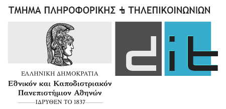

# 
Επικοινωνία Ανθρώπου Μηχανής - Άσκηση 3 - Χειμερινού Εξαμήνου 2021-2022

Υπεύθυνη Καθηγήτρια: Ρούσσου Μαρία
 

**Προσωπικά Δεδομένα Ομάδας:**  
* Σκευοφύλακα Μαρία, ΑΜ: 1115201900173  
* Παπασωτήρη Χριστίνα, ΑΜ: 1115201900151

**Παραδοτέα αρχεία:** 
* στον κυρίως φάκελο:
    - sdi1900151.sql, η βάση δεδομένων με όλους τους πίνακες και δοκιμαστικούς χρήστες
    - server.php, η σύνδεση με τη βάση
    - index.php
    - contact.php, περιέχει τοποθεσία και τηλέφωνα 
    - diadikasia_aitisis.php, η σελίδα που περιγράφει αναλυτικά την αίτηση και οδηγεί στην ίδια την αίτηση
    - signup.php, η φόρμα εγγραφής
    - submit.php είναι η εγγραφή
    - login.php, η φόρμα εισαγωγής
    - loginProcess.php, εκτέλεση του login
    - logout.php, εκτέλεση του logout
    - aitisi.php, προωθεί στην αντίστοιχη σελίδα αναλογα την κατάσταση της αίτησης
    - aitisi1.php, η αίτηση
    - aitisi2.php, δείχνει την απάντηση της αίτησης    
    - prosorini.php, δείχνει την αίτηση στον χρήστη και μπορεί να την οριστικοποιήσει
    - prosorini_submit.php
    - oristiki.php, υποβάλει οριστικά την αποθηκευμένη αίτηση
    - insert.php, εγγραφή χρήστη
    - diaxeiristis.php, προβολή λίστας αιτήσεων
    - ekremis.php, εισαγωγή εκρεμούς αποτελέσματος
    - apodoxi.php, εισαγωγή θετικού αποτελέσματος στη βάση
    - apotelesma.php, επιλογή αποτελέσματος
    - notes.php, εισαγωγή σχολιων διαχειριστή

* /css
    - temp.css, για την index.php
    - aitisi.css, για την aitisi1.php
    - diaxeiristis.css
    - main.css, για το main section κάθε σελίδας
    - login.css
    - contact.css, για την contact.php

* /js/index.js για κάθε σελίδα

**Προβολή ιστότοπου:** 
* Για την χρησιμοποίηση της βάσης περιλαμβάνεται ένα .sql αρχείο το οποίο θα γίνει IMPORT μέσα στο phpmyadmin σε μία βάση με όνομα sdi1900173sdi1900151 
* http://localhost/phpmyadmin/index.php
* http://localhost/eam_project/index.php

**Σύνδεση:** 
Δοκιμαστικοί κωδικοί Χρήστη και Διαχειριστή (email, password):
* Χρήστη(user@gmail.gr, userA1234@)
* Διαχειριστή(admin@gmail.gr, adminB1234@)

**Υλοποίηση:** 
* Σκοπός της εργασίας ήταν ο επανασχεδιασμός του ιστότοπου ΔΟΑΤΑΠ για την αναγνώριση πτυχίων εξωτερικού στην Ελλάδα.  
* Χρήστης:
    - Στην υλοποίηση μας ο ιστότοπος υποστηρίζει σύνδεση και εγγραφή νέου χρήστη ζητώντας κάποια βασικά δεδομένα(ονοματεπωνυμο, αριθμό δελτίου ταυτότητας, τηλέφωνο κλπ) και τα αποθηκεύει σε μία βάση δεδομένων. 
    - Αν ο χρήστης έχει συνδεθεί, έχει την δυνατότητα να μπει και να υποβάλει αίτηση.
    - Η φόρμα της αίτησης παίρνει από την βάση τα δεδομένα που ο χρήστης έχει ήδη υποβάλει κατά την εγγραφή του και ζητάει μόνο τα επιπλέον στοιχεία που αφορούν τον τίτλο σπουδών.  Στη συνέχεια είναι σε θέση είτε να αποθηκεύσει προσωρινά την αίτηση του είτε να την υποβάλλει οριστικά.  Σε περίπτωση προσωρινής αποθήκευσης μπορεί να την δει και να την επεξεργαστεί όσες φορές θέλει μέχρι να την υποβάλλει οριστικά.  Μόλις την υποβάλλει οριστικά, η αίτηση γίνεται ορατή στον διαχειριστή, ενώ ο χρήστης μπορεί πλέον να την βλέπει αλλά όχι να την επεξεργάζεται.
    - Μόλις η αίτηση απαντηθεί ο χρήστης μπορεί να βλέπει το αποτέλεσμα της.
*  Διαχειριστής:
    - Μόλις συνδεθεί ο διαχειριστής βρίσκεται μπροστά σε μία λίστα με αιτήσεις προς απάντηση τις οποίες αρχικά τις βλέπει σε μία συνοπτική μορφή όπου προβάλλονται τα βασικά στοιχεία των υποψηφίων() και τα βασικά στοιχεία του τίτλου σπουδών().  
    - Επίσης μπορεί να δει αν η αίτηση πληρεί τα κριτήρια για να αντιστοιχηθεί αυτόματα σε κάποιο πανεπιστήμιο. 
    - Από αυτό το μενού μπορεί να απαντήσει κάθε αίτηση. Μόλις πατήσει να την απαντήσει είτε απορρίψει/αποδεχτεί/αφήσει εκκρεμή,  βλέπει πλέον αναλυτικά την αίτηση όπου είτε ορίζει με ποιο τμήμα αντιστοιχίζεται είτε τον λόγο για τον οποίο απορρίπτεται ή προτείνει μαθήματα από συγκεκριμένο τμήμα που οφείλει να περάσει ο αιτούντας προκειμένου να αναγνωριστεί το πτυχίο του. 
* Η βάση την οποία χρησιμοποιούμε ονομάζεται sdi1900151 και περιλαμβάνει τους εξής πίνακες:
    - users: Περιλαμβάνει τους χρήστες που έχουν κάνει εγγραφή στην εφαρμογή με πρωτεύον κλειδί τον αριθμό δελτίου ταυτότητας κάθε χρήστη.
    - aitiseis: Περιλαμβάνει τα προσωπικά στοιχεία κάθε χρήστη που χρησιμοποιούνται για κάθε αίτηση με πρωτεύον κλειδί τον αριθμό δελτίου ταυτότητας κάθε χρήστη.
    - aitiseis_titlos: Περιλαμβάνει τα στοιχεία κάθε χρήστη που αφορούν τον τίτλο για τον οποίο έχει υποβάλει αίτηση να αναγνωριστεί με πρωτεύον κλειδί τον αριθμό δελτίου ταυτότητας κάθε χρήστη το οποίο είναι και ξένο κλειδί με τον πίνακα aitiseis.
    - files: Περιλαμβάνει τα επισυναπτόμενα δικαιολογητικά έγγραφα που υποβάλλει ο χρήστης με την αίτηση του με πρωτεύον κλειδί τον αριθμό δελτίου ταυτότητας κάθε χρήστη το οποίο είναι και ξένο κλειδί με τον πίνακα aitiseis.
    - mathimata: Περιλαμβάνει προτεινόμενα μαθήματα από διάφορα τμήματα ελληνικών πανεπιστημίων που οφείλει να παρακολουθήσει ο αιτούντας προκειμένου να αναγνωριστεί το πτυχίο του. Πρωτεύον κλειδί του πίνακα: ένας κωδικός id. 
    - results: Σε περίπτωση αποδεκτής ή εκκρεμούς αίτησης σε αυτόν τον πίνακα φαίνεται με ποιο τμήμα αντιστοιχίζεται ο τίτλος ή με ποιο θα αντιστοιχηθεί. 
    - universities_exoteriko: Demo πίνακας με πανεπιστήμια αλλοδαπής και με ποιο τμήμα ελληνικού πανεπιστημίου αντιστοιχίζονται.
    - universities: Demo πίνακας με ελληνικά πανεπιστήμια.

**Σχεδιαστικές επιλογές - Παραδοχές:**  
* Παραδοχή: Καθε τμημα αντιστοιχιζεται μόνο με ένα αλλο και τα εξτρα μαθήματα τα διαλέγει ο διαχειριστής